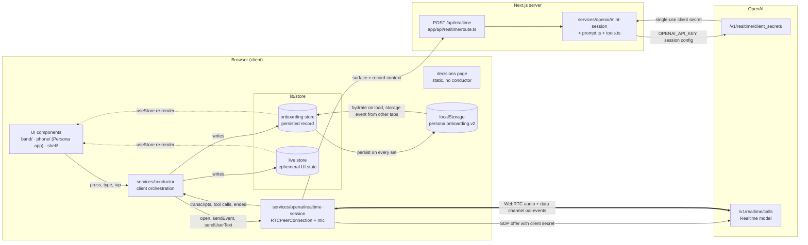
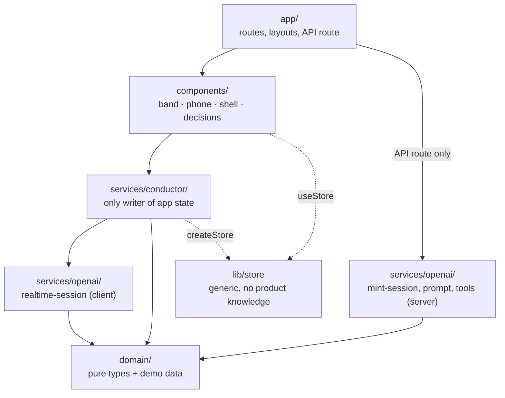
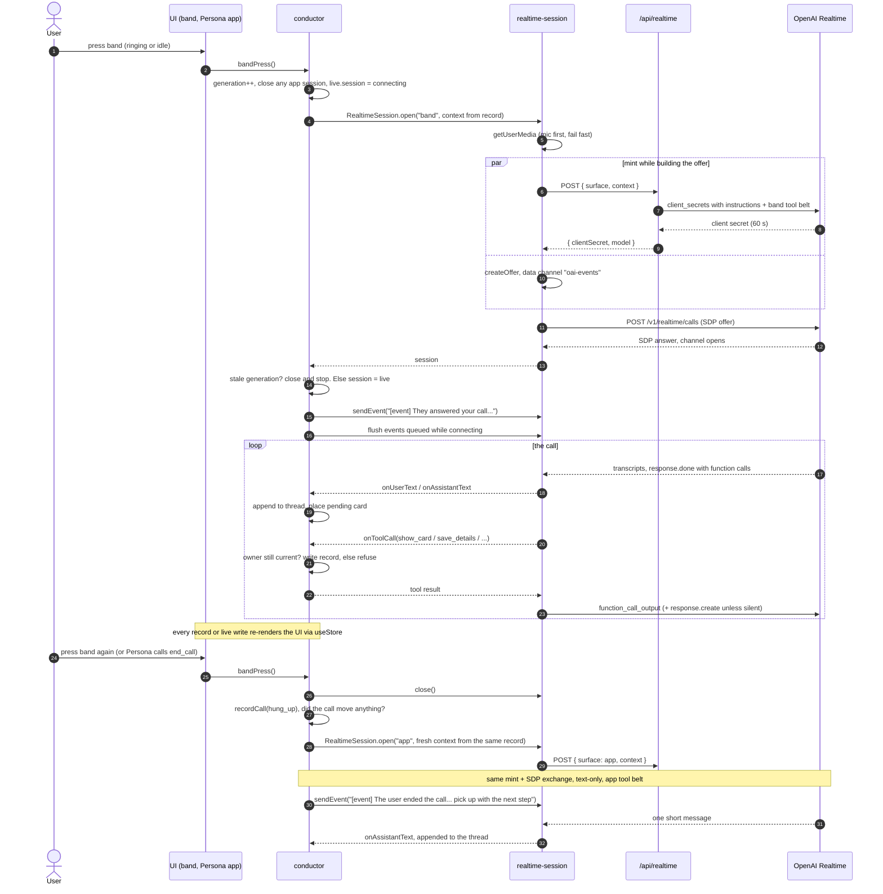
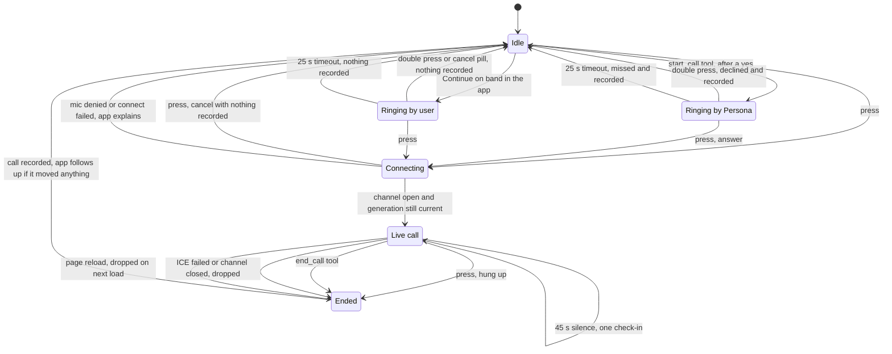

# Architecture

A browser-only prototype of Persona's onboarding. Two surfaces, the **band**
(voice calls) and the **Persona app** on a simulated phone (messaging), share
one conversation. OpenAI Realtime does the talking; everything the conversation
learns lives in one record in `localStorage`. The only server code mints
short-lived OpenAI credentials.

## System overview



- **The API key never leaves the server.** The route turns `{ surface, context }`
  into a 60-second client secret whose session config (instructions, tools,
  voice, VAD) is fixed server-side. The browser then negotiates WebRTC with
  OpenAI directly; audio never touches our server.
- **Three kinds of state**, all in `services/conductor/state.ts`:
  - `onboarding`: the persisted record (`domain/onboarding.ts`: profile, Gmail
    status, calls, thread of messages/cards/events/reminders). The source of truth.
  - `live`: ephemeral UI state (which phone screen, session status, ringing,
    buzz, banner, caption). Gone on reload, by design.
  - `runtime`: the conductor's private, non-reactive working state (current
    session, generation counter, queued events, timers). Not rendered.

## Layers



Rules (from `AGENTS.md`): dependencies point down only; `domain/` imports
nothing; components read stores and call conductor functions, never OpenAI or
`localStorage`; server code (`mint-session.ts`, the route) never imports client
code. Components may import `domain/` types and constants directly.

## The key flow: press the band, talk, hand back to the app



Notes on the diagram:

- **Instructions are built at mint time on the server**, not by a client
  `session.update`. `prompt.ts#buildInstructions` renders identity, voice,
  channel, goals, what is known, past calls and the tail of the thread
  (`historyLines`) into the session config.
- **Why a session is opening** always arrives as one `[event] …` system message
  right after it connects. The app session after a call is only opened if the
  call progressed something (a saved detail, a card answered, real speech).

## Band call lifecycle



- A press also dismisses a buzzing reminder first; if a call is ringing at the
  same time, the same press answers it.
- A press within 600 ms of a call ending is ignored (the tail of a multi-press).
- Persona stops placing calls after two missed or declined ones (`ringBand`).
- Only Persona's ring is persisted (`personaRingingSince`), so a reload mid-ring
  still counts as missed. An open call is persisted as `callStartedAt`, so a
  reload mid-call is recorded as dropped.

## Core ideas

- **One record, many sessions.** No session carries memory forward. Each one is
  minted fresh from the persisted record, and told in one `[event]` line why it
  is opening. That is all "start anywhere, resume anywhere" is.
- **At most one realtime session.** `sessions.ts#connect` closes whatever was
  open before connecting. The band and the app never hold the conversation at
  the same time; text typed during a call joins the call.
- **Stale work can't write.** Every open, cancel and reset bumps
  `runtime.generation`. A connect that lands late closes itself; a tool call
  checks `owner === runtime.session` before and after any await; timers check
  that their thread item still exists.
- **Connecting means queue.** `deliver()` sends to the live session, queues in
  `runtime.pendingEvents` while one is opening, or opens an app session if
  nothing is open and the event wants a reply. Typed messages wait on the open
  in flight.
- **Cards are non-blocking and follow their line.** `show_card` returns at once;
  the card is placed after the sentence that introduces it (waits for speech to
  end on a call, or for the next assistant line in the app, max 6 s). The tap
  comes back later as an `[event]` via `completeCard`. Answering in words
  settles open cards the same way (`save_details`).
- **Silent tools.** `show_card`, `start_call`, `set_reminder` and `graduate`
  don't earn a second reply when the response already spoke; `save_details`
  rides along silently with them. A failed tool always gets a reply.
- **Held inbox finds.** When the demo inbox scan finishes, the finds are held
  until the "used an agent before?" answer makes them useful (straight away for
  yes; with the next answer for no), capped at 3 user turns or 60 s. On a call
  they are spoken; if the call ends before one is picked they come back as a card.
- **Timers survive reload.** Reminders and the inbox scan store absolute times
  (`firesAt`, `readyAt`) in the record; `lifecycle.ts#hydrate` re-arms them,
  re-holds undelivered finds, and records dropped calls and missed rings.
- **Tabs share one record.** A `storage` event from another tab is adopted
  (`store.adopt`) rather than overwritten.
- **Deterministic before prompted.** Anything the brief requires (card
  ordering, one reminder per onboarding, no re-asking declined Gmail, call
  limits) is enforced in tool handlers and steered through tool results, not
  left to the prompt.

## Directory map

```
src/
  app/
    page.tsx                 Loads shell/app client-only (ssr: false)
    api/realtime/route.ts    POST: validate, mintSession, plain error on failure
    decisions/               Static design-decisions page (content.ts + page)
  components/
    band/                    Wrist photo, press/double-press, presence ring
    phone/                   Home screen, Persona app thread, cards, consent sheet, call pill
    shell/                   Two-device layout, reset button, top bar
    decisions/               Views for the decisions page
  domain/
    onboarding.ts            Record types, schema version, parseSaved, historyLines
    demo.ts                  Everything simulated: Google account, inbox, time compression
  lib/store.ts               createStore (optional localStorage), useStore
  services/
    openai/
      mint-session.ts        Server: session config + client secret
      prompt.ts              buildInstructions(surface, context): Persona's voice and goals
      tools.ts               Tool schemas and the per-surface belts
      realtime-session.ts    Client: WebRTC, mic, oai-events protocol, speech timing
    conductor/
      index.ts               Public API the components use
      state.ts               The onboarding, live and runtime state
      thread.ts              Appending to the thread, call records, card placement
      sessions.ts            Open/close sessions, deliver events, transcripts, silence check
      calls.ts               Band presses, ringing, ending calls, after-call follow-up
      tool-handlers.ts       runTool: save_details, show_card, end_call, redact, graduate
      cards.ts               Card taps and settling, consent sheet, card [event] text
      inbox.ts               Demo inbox scan and when its finds are delivered
      reminders.ts           set_reminder, arming timers, the buzz
      lifecycle.ts           hydrate (restore and re-arm), cross-tab adopt, reset
      phone.ts               Phone screens, banners, sendText, voice levels
```

## Where to make common changes

**Add a tool**
1. Schema in `services/openai/tools.ts`; add it to the belt of each surface
   that should have it (`BELTS`).
2. Handle it in `services/conductor/tool-handlers.ts#runTool`. Validate
   arguments as `unknown`, and return a result that steers the model
   (`{ status, note }` or `{ error }`).
3. If its introducing line is the whole point, add it to `SILENT_TOOLS` in
   `sessions.ts`.
4. Mention it in `prompt.ts` only if the model needs to know when to use it.

**Change Persona's voice**
- Words and tone: `VOICE` and `CHANNEL` in `services/openai/prompt.ts` (change
  the prompt, not the output).
- The spoken voice, model, transcription model: env vars read in
  `mint-session.ts` (`OPENAI_REALTIME_VOICE`, `OPENAI_REALTIME_MODEL`,
  `OPENAI_TRANSCRIPTION_MODEL`).
- Post-processing of transcripts (em dashes, duplicate lines):
  `sessions.ts#onTranscript`.

**Add a card kind**
1. `domain/onboarding.ts`: extend `CardKind` (and `CardResult` if it has a new
   outcome; update `describeResult` for history).
2. `tools.ts`: add it to the `show_card` enum and description.
3. `tool-handlers.ts`: a banner in `CARD_BANNERS`, and any guard in `showCard`.
4. `cards.ts`: what a tap writes in `completeCard`, the user-side text in
   `answerText`, the `[event]` in `cardEvent`.
5. `components/phone/cards.tsx`: render it in `CardBody`.
